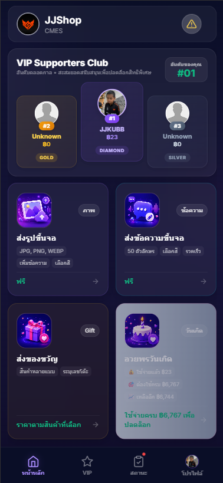
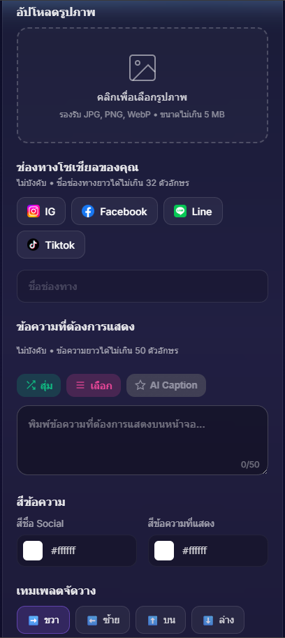
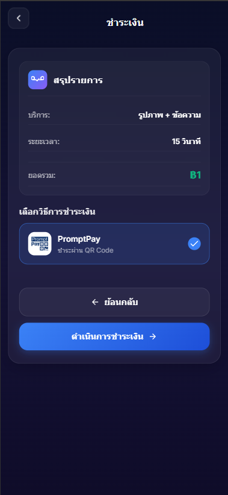

<p align="center">
  <h1 align="center">🖥️ CMES-USER</h1>
  <p align="center">
    <strong>Content Management & Entertainment System — User App</strong>
    <br />
    ระบบ Digital Signage สำหรับร้านเหล้า ผับ บาร์ — ฝั่งลูกค้า
    <br /><br />
    <a href="https://cmes-user-frontend.vercel.app/?shopId=JJ"><strong>🌐 Live Demo »</strong></a>
    &nbsp;&nbsp;·&nbsp;&nbsp;
    <a href="#-screenshots">Screenshots</a>
    &nbsp;&nbsp;·&nbsp;&nbsp;
    <a href="#-quick-start">Quick Start</a>
    &nbsp;&nbsp;·&nbsp;&nbsp;
    <a href="./SKILL.md">SKILL.md</a>
  </p>
</p>

<p align="center">
  
  
  
  
  
  
  
  
</p>

---

## 📋 Table of Contents

- [About](#-about)
- [Screenshots](#-screenshots)
- [Architecture](#-architecture)
- [Features](#-features)
- [Tech Stack](#-tech-stack)
- [Quick Start](#-quick-start)
- [Environment Variables](#-environment-variables)
- [Project Structure](#-project-structure)
- [API Reference](#-api-reference)
- [Deployment](#-deployment)
- [Related Repos](#-related-repos)
- [License](#-license)

---

## 📖 About

**CMES-USER** คือแอปพลิเคชันฝั่งลูกค้าสำหรับระบบ Digital Signage ในร้านเหล้า/ผับ/บาร์ ลูกค้าสามารถ:

- 📸 อัปโหลดรูปภาพพร้อม caption ขึ้นจอในร้าน
- 🤖 ใช้ AI สร้าง caption อัตโนมัติ (Google Gemini)
- 💬 ส่งข้อความขึ้นจอ
- 🎁 ส่งของขวัญไปยังโต๊ะอื่น
- 🎂 ส่งข้อความอวยพรวันเกิด
- 💳 ชำระเงินผ่าน QR Code + ตรวจสลิปอัตโนมัติด้วย OCR
- 🏆 ดูอันดับผู้สนับสนุนอันดับต้น

> **Multi-tenant Architecture** — รองรับหลายร้านด้วย `shopId` แยกข้อมูลอิสระ

---

## 📸 Screenshots


<p align="center">
  
  &nbsp;&nbsp;
  
  &nbsp;&nbsp;
  
</p>


| หน้า | คำอธิบาย |
|------|----------|
| **Register** | สมัครสมาชิก / เข้าสู่ระบบ (Email + Google OAuth) |
| **Home** | Dashboard — Ranking, บริการทั้งหมด, Bottom Navigation |
| **Upload** | อัปโหลดรูป + AI Caption + เลือกสี/layout |
| **Payment** | QR Code ชำระเงิน + อัปโหลดสลิป (OCR verify) |
| **Gift** | เลือกของขวัญ → เลือกโต๊ะ → ชำระเงิน |
| **Profile** | แก้ไขโปรไฟล์, avatar, วันเกิด |

---

## 🏗 Architecture

```
┌──────────────────┐     ┌──────────────────┐     ┌──────────────────┐
│   CMES-USER      │     │   CMES-USER      │     │   CMES-ADMIN     │
│   Frontend       │────▶│   Backend        │────▶│   Backend        │
│   (React/Vercel) │     │   (Express/Render)│     │   (Express/Render)│
└──────────────────┘     └──────────────────┘     └──────────────────┘
        │                        │                        │
        │                  ┌─────┴─────┐            ┌─────┴─────┐
        │                  │ MongoDB   │            │ Socket.IO │
        │                  │ Atlas     │            │ Server    │
        │                  └───────────┘            └───────────┘
        │                        │
        │                  ┌─────┴─────┐
        └─────────────────▶│ Cloudinary│
                           │ (Storage) │
                           └───────────┘
```

---

## ✨ Features

| Category | Features |
|----------|----------|
| **Authentication** | Email/Password register, Login, Google OAuth, JWT (7-day), Protected Routes |
| **Image Upload** | อัปโหลดรูป, AI Caption (Gemini), เลือกสี/layout, QR Code overlay |
| **Text Message** | ส่งข้อความขึ้นจอ, เลือกสีตัวอักษร |
| **Gift System** | เลือกของขวัญ, เลือกโต๊ะ, ส่งพร้อมข้อความ |
| **Birthday** | ตรวจวันเกิดอัตโนมัติ, ส่งข้อความอวยพร (ต้องยอดใช้จ่ายขั้นต่ำ) |
| **Payment** | QR Code, อัปโหลดสลิป, OCR ตรวจจำนวนเงินอัตโนมัติ |
| **Ranking** | คะแนนสะสม Daily/Monthly/All-time, Top 3 บน Home |
| **AI** | Google Gemini 2.5 Flash, auto-caption ภาษาไทย Gen Z, retry + fallback models |
| **Realtime** | Socket.IO — สถานะระบบ, ranking updates |
| **Multi-tenant** | `shopId` แยกร้าน, รองรับหลาย tenant |

---

## 🛠 Tech Stack

| Layer | Technology |
|-------|-----------|
| **Frontend** | React 19, React Router 7, Vanilla CSS (Dark glassmorphism) |
| **Backend** | Node.js, Express 4, ES Modules |
| **Database** | MongoDB Atlas + Mongoose 8 |
| **Auth** | JWT + bcryptjs + Google OAuth |
| **AI** | Google Gemini 2.5 Flash (caption generation) |
| **OCR** | Tesseract.js 5 (slip verification) |
| **Realtime** | Socket.IO 4 |
| **Storage** | Cloudinary (images, slips, avatars) |
| **Email** | Nodemailer + Gmail |
| **Deploy** | Vercel (frontend) + Render (backend) |

---

## 🚀 Quick Start

### Prerequisites

- Node.js 18+
- npm
- MongoDB Atlas account ([free tier](https://cloud.mongodb.com))
- Cloudinary account ([free tier](https://cloudinary.com))

### 1. Clone & Install

```bash
git clone https://github.com/66JJN/CMES-USER
cd CMES-USER

# Backend
cd backend
cp .env.example .env    # แก้ไขค่าใน .env
npm install

# Frontend (new terminal)
cd frontend
cp .env.example .env    # แก้ไขค่าใน .env
npm install
```

### 2. Configure Environment

แก้ไข `backend/.env` — ดู [Environment Variables](#-environment-variables) สำหรับรายละเอียด

### 3. Run Development

```bash
# Terminal 1 — Backend (port 5002)
cd backend
npm run dev

# Terminal 2 — Frontend (port 3000)
cd frontend
npm start
```

### 4. Open App

```
http://localhost:3000/?shopId=demo
```

---

## 🔑 Environment Variables

### Frontend (`frontend/.env`)

| Variable | Description | Default |
|----------|-------------|---------|
| `REACT_APP_API_BASE_URL` | User backend URL | `http://localhost:5002` |
| `REACT_APP_ADMIN_API_URL` | Admin backend URL | `http://localhost:5001` |
| `REACT_APP_REALTIME_URL` | Socket.IO URL | `http://localhost:5001` |
| `REACT_APP_GOOGLE_CLIENT_ID` | Google OAuth Client ID | — |

### Backend (`backend/.env`)

| Variable | Description | Required |
|----------|-------------|----------|
| `MONGODB_URI` | MongoDB connection string | ✅ |
| `JWT_SECRET` | JWT signing secret (64+ chars) | ✅ |
| `CLOUDINARY_CLOUD_NAME` | Cloudinary cloud name | ✅ |
| `CLOUDINARY_API_KEY` | Cloudinary API key | ✅ |
| `CLOUDINARY_API_SECRET` | Cloudinary API secret | ✅ |
| `ADMIN_API_BASE` | Admin backend URL | ✅ |
| `GEMINI_API_KEY` | Google Gemini API key | Optional |
| `EMAIL_USER` | Gmail address | Optional |
| `EMAIL_PASS` | Gmail app password | Optional |
| `PORT` | Server port | `5002` |

> 📄 ดูตัวอย่างทั้งหมดที่ [`frontend/.env.example`](./frontend/.env.example) และ [`backend/.env.example`](./backend/.env.example)

---

## 📁 Project Structure

```
CMES-USER/
├── frontend/
│   ├── src/
│   │   ├── 01_Home/          # Home dashboard + ranking
│   │   ├── 02_Profile/       # User profile management
│   │   ├── 03_Register/      # Register / Login / Google OAuth
│   │   ├── 04_Payment/       # QR Code + Slip upload
│   │   ├── 05_Select/        # Service selection
│   │   ├── 06_Slip upload/   # Slip upload flow
│   │   ├── 07_Report/        # Bug report
│   │   ├── 08_Gift/          # Gift system
│   │   ├── 09_Upload/        # Image/text upload
│   │   ├── 10_Status/        # Order status
│   │   ├── config/           # apiConfig.js, googleConfig.js
│   │   ├── authService.js    # ★ Central auth + API utility
│   │   ├── ProtectedRoute.js # Route guards
│   │   └── App.js            # Router + auth init
│   └── package.json
│
├── backend/
│   ├── server.js             # ★ Express + all API routes
│   ├── routes/auth-mongodb.js# Auth endpoints
│   ├── middleware/            # JWT verification
│   ├── models/               # User, GiftOrder, Report
│   └── package.json
│
├── SKILL.md                  # AI coding guidelines
└── README.md                 # ← You are here
```

---

## 📡 API Reference

### Authentication
| Method | Endpoint | Description |
|--------|----------|-------------|
| `POST` | `/api/auth/register` | สมัครสมาชิก |
| `POST` | `/api/auth/login` | เข้าสู่ระบบ |
| `POST` | `/api/auth/logout` | ออกจากระบบ |
| `POST` | `/api/auth/verify-token` | ตรวจสอบ token |
| `GET` | `/api/auth/profile` | ดูโปรไฟล์ |
| `PUT` | `/api/auth/profile` | แก้ไขโปรไฟล์ |

### Core Features
| Method | Endpoint | Description |
|--------|----------|-------------|
| `POST` | `/api/upload` | อัปโหลดรูป/ข้อความ (pending) |
| `POST` | `/api/confirm-payment` | ยืนยันชำระเงิน → ส่งไป Admin |
| `POST` | `/verify-slip` | OCR ตรวจสลิปโอนเงิน |
| `POST` | `/api/generate-caption` | AI สร้าง caption (Gemini) |
| `POST` | `/api/report` | ส่งรายงานปัญหา |
| `GET` | `/api/check-birthday` | ตรวจวันเกิด |

> **หมายเหตุ:** ทุก request ต้องส่ง `shopId` ทั้ง query param (`?shopId=xxx`) และ header (`x-shop-id`)

---

## 🚢 Deployment

### Frontend → Vercel
```bash
cd frontend
npx vercel --prod
```
ตั้ง Environment Variables ใน Vercel Dashboard

### Backend → Render
1. สร้าง **Web Service** ใน [Render](https://render.com)
2. Root Directory: `backend`
3. Build Command: `npm install`
4. Start Command: `node server.js`
5. ตั้ง Environment Variables ใน Render Dashboard

---

## 🔗 Related Repos

| Repo | Description |
|------|-------------|
| [CMES-ADMIN](https://github.com/66JJN/CMES-ADMIN) | Admin Dashboard — จัดการระบบ, คิวรูปภาพ, ของขวัญ, OBS overlay |

---

## 📄 License

ISC License — feel free to use and modify.

---

<p align="center">
  Made with ❤️ by <a href="https://github.com/66JJN">SUPHAKON SAEPAN</a>
</p>
