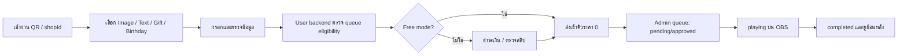
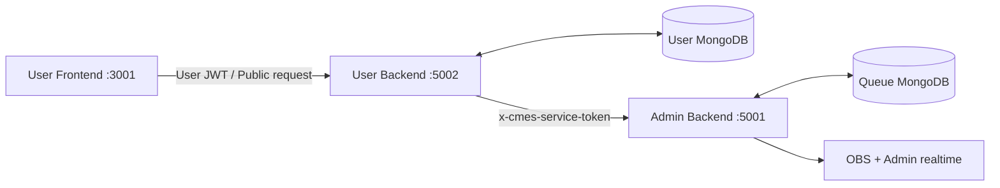

<div align="center">

# CMES-USER

**เว็บสำหรับลูกค้าส่งรูป ข้อความ ของขวัญ และคำอวยพรขึ้นจอของร้าน พร้อมชำระเงินและติดตามคิวแบบ realtime**

[Live Demo](https://cmes-user-frontend.vercel.app/?shopId=JJ) · [CMES-ADMIN](https://github.com/66JJN/CMES-ADMIN)


</div>

## ภาพรวม

CMES-USER คือ customer-facing application ของระบบ CMES ลูกค้าเข้าผ่านลิงก์หรือ QR Code ของร้าน สมัครสมาชิก เลือกบริการ ออกแบบคอนเทนต์ ชำระเงินเมื่อร้านเปิดโหมดคิดเงิน และติดตามสถานะตั้งแต่ส่งรายการจนแสดงเสร็จบนจอ

Frontend ฝั่ง User ติดต่อเฉพาะ CMES-USER backend เท่านั้น งานที่ต้องเข้าคิวกลางจะถูกส่งต่อจาก User backend ไป CMES-ADMIN backend ด้วย service token ภายใน จึงไม่เปิด Admin API หรือ secret ให้ browser

### จุดเด่น

- ส่งรูปพร้อมข้อความ/social, ข้อความล้วน, ของขวัญ และคำอวยพรวันเกิด
- สถานะระบบ ราคาแพ็กเกจ ranking, birthday eligibility และรายละเอียดคำสั่งซื้ออัปเดตแบบ realtime
- Free mode จาก server: ไม่แสดงขั้นตอนชำระเงินและไม่เชื่อราคาจาก query/browser
- ตรวจสิทธิ์และจำนวน active queue ก่อนเข้าสู่ขั้นตอนรับชำระเงิน
- ป้องกันการกดซ้ำด้วย submission ID/idempotency ที่ฝั่ง Admin queue
- รูปภาพรองรับ JPG, PNG และ WebP ขนาดไม่เกิน 10 MB
- จำกัด active queue ค่าเริ่มต้น 3 รายการต่อผู้ใช้/ผู้ส่ง
- Rate limit แยก auth, upload, AI caption, payment confirmation และ gift order
- Error แสดงใน modal ที่ผู้ใช้กำลังทำงานอยู่ พร้อมข้อความจาก server ที่อ่านเข้าใจได้
- รองรับ email/password, Email OTP และ Google OAuth

## Screenshots

> เปลี่ยนภาพล่าสุดได้โดยใช้ชื่อไฟล์เดิมใน `docs/screenshots/`

<p align="center">
  
  
  
</p>

## Customer flow



### การอนุมัติคอนเทนต์

- Text: เข้า approved อัตโนมัติหลังผ่าน validation
- Image/Birthday: SightEngine ตรวจรูปที่ Admin backend เมื่อเปิด AI moderation
- รูปปลอดภัย: approved อัตโนมัติ
- รูปที่ถูก flag หรือ AI ตรวจไม่ได้: ค้าง pending ให้ Admin ตรวจ
- Gift: ใช้รูปสินค้าและรายการที่ Admin ตั้งไว้

## สถาปัตยกรรมและ security boundary



- `JWT_SECRET` ใช้เซ็น token สมาชิกของ CMES-USER
- `USER_SERVICE_TOKEN` ใช้เฉพาะ backend-to-backend และต้องตรงกับ CMES-ADMIN backend
- ห้ามนำ `USER_SERVICE_TOKEN` ไปใส่ใน `REACT_APP_*` หรือส่งลง browser
- User browser ไม่ส่ง `x-admin-id`/`x-shop-id` เพื่อขอสิทธิ์ Admin
- `shopId` ระบุร้าน แต่สิทธิ์สำคัญถูกตรวจและผูกโดย backend
- Helmet, CORS allowlist, Mongo sanitization และ rate limit ทำงานที่ User backend

## Validation และข้อจำกัด

| รายการ | ข้อจำกัดปัจจุบัน |
|---|---|
| รูป content/avatar | JPG, PNG หรือ WebP ไม่เกิน 10 MB |
| Slip | สูงสุด 10 MB; storage รองรับ JPG/JPEG/PNG/PDF |
| หมายเลขผู้ส่งของขวัญ | ตัวเลขครบ 10 หลัก |
| Active queue | ค่าเริ่มต้นสูงสุด 3 รายการต่อผู้ใช้/ผู้ส่ง |
| Content submission | ผู้ใช้ที่ login 6 ครั้ง/10 นาที; guest รวมตาม IP 60 ครั้ง/10 นาที |
| Payment confirmation | ผู้ใช้ที่ login 12 ครั้ง/10 นาที; guest รวมตาม IP 80 ครั้ง/10 นาที |
| Gift order | ผู้ใช้ที่ login 5 ครั้ง/10 นาที; guest รวมตาม IP 60 ครั้ง/10 นาที |
| AI caption | production 50 ครั้ง/15 นาทีต่อ rate-limit key |

Guest quota ตั้งสูงกว่าเพื่อรองรับหลายคนที่แชร์ Wi‑Fi/NAT ของร้าน ขณะที่ active queue และ idempotency ป้องกันคนเดียวเติมคิวมากเกินไป

## Payment และ Free mode

### โหมดคิดเงิน

1. User backend สร้าง pending upload/order
2. ตรวจ queue eligibility กับ Admin backend ก่อนรับชำระเงิน
3. แสดง QR ที่ Admin ตั้งค่าไว้
4. ผู้ใช้อัปโหลดสลิปและระบบตรวจข้อมูล/OCR
5. เมื่อยืนยันสำเร็จ User backend ส่งรายการไป Admin backend
6. Ranking/income อัปเดตจากการชำระเงินสำเร็จ ส่วนประวัติการแสดงจบอัปเดตเมื่อคิว completed

### Free mode

- Admin backend เป็นผู้กำหนด `freeMode`
- ราคา effective เป็น `0` ที่ server แม้ browser ส่งราคาอื่นมา
- User frontend ข้าม payment UI ตาม config จาก server
- Birthday ไม่ติดเงื่อนไขยอดใช้จ่ายใน Free mode
- Ranking/income จากยอดเงินถูกปิดหรือคืนค่าเป็นศูนย์ตาม API

## Tech Stack

| ส่วน | เทคโนโลยี |
|---|---|
| Frontend | React 19, React Router 7, Vanilla CSS, Socket.IO Client |
| Backend | Node.js, Express 4, ES Modules |
| Database | MongoDB Atlas, Mongoose 8 |
| Authentication | JWT, bcryptjs, Google OAuth, Email OTP |
| Storage | Cloudinary |
| AI | Google Gemini สำหรับ caption |
| OCR | Tesseract.js สำหรับอ่านข้อมูลสลิป |
| Operations | Helmet, CORS allowlist, rate limiting, Mongo sanitization |
| Deployment | Vercel frontend, Render backend |

## Local services

ระบบ CMES ใช้พอร์ตคงที่ดังนี้:

| Service | URL |
|---|---|
| CMES-ADMIN frontend | `http://localhost:3000` |
| CMES-ADMIN backend | `http://localhost:5001` |
| CMES-USER frontend | `http://localhost:3001` |
| CMES-USER backend | `http://localhost:5002` |

## Quick Start

### Requirements

- Node.js 20+
- npm
- MongoDB Atlas
- Cloudinary
- CMES-ADMIN backend ที่ port 5001 สำหรับ queue/config แบบครบระบบ
- Google OAuth, Gmail, Gemini และ OCR ใช้ตามฟีเจอร์ที่ต้องการทดสอบ

### ติดตั้ง

```powershell
git clone https://github.com/66JJN/CMES-USER.git
cd CMES-USER

cd backend
Copy-Item .env.example .env
npm install

cd ../frontend
Copy-Item .env.example .env
npm install
```

ตั้ง `PORT=3001` ใน `frontend/.env` และใส่ environment ที่จำเป็นก่อนเปิดระบบ ห้าม commit `.env`

### เปิดระบบ local

```powershell
# Terminal 1 — User backend :5002
cd D:\CMES-USER\backend
npm run dev

# Terminal 2 — User frontend :3001
cd D:\CMES-USER\frontend
npm start
```

เปิด `http://localhost:3001/?shopId=JJ` โดยเปลี่ยน `JJ` เป็น shop ID ที่มีอยู่จริง

## Environment Variables

ดูค่าตัวอย่างที่ [backend/.env.example](./backend/.env.example) และ [frontend/.env.example](./frontend/.env.example)

### User backend

| Variable | หน้าที่ | Required |
|---|---|---|
| `MONGODB_URI` | MongoDB connection ของสมาชิก/pending orders | Yes |
| `JWT_SECRET` | เซ็น token สมาชิก; ใช้ค่าคงที่และสุ่มยาว | Yes |
| `USER_SERVICE_TOKEN` | ติดต่อ Admin backend; ต้องตรงกับฝั่ง Admin | Yes |
| `ADMIN_API_BASE` | Admin backend URL เช่น `http://localhost:5001` | Yes |
| `USER_FRONTEND_URL` | CORS allowlist ของ User frontend | Yes |
| `ADMIN_FRONTEND_URL` | CORS allowlist ที่ต้องอนุญาต | Yes |
| `CLOUDINARY_CLOUD_NAME` | Cloudinary account | Yes |
| `CLOUDINARY_API_KEY` | Cloudinary API key | Yes |
| `CLOUDINARY_API_SECRET` | Cloudinary API secret | Yes |
| `GOOGLE_CLIENT_ID` | ตรวจ Google OAuth token | Optional |
| `GEMINI_API_KEY` | สร้าง AI caption | Optional |
| `EMAIL_USER` | Email สำหรับ OTP | Optional |
| `EMAIL_PASS` | Gmail app password | Optional |
| `PORT` | User backend port; default `5002` | Optional |

### User frontend

| Variable | Local value |
|---|---|
| `PORT` | `3001` |
| `REACT_APP_API_BASE_URL` | `http://localhost:5002` |
| `REACT_APP_GOOGLE_CLIENT_ID` | Google OAuth client ID |

User frontend ปัจจุบันไม่ต้องมี Admin API URL หรือ service token เพราะเรียกผ่าน User backend เท่านั้น

## API สำคัญ

Endpoint ด้านล่างเป็นภาพรวม โปรดดู `backend/routes/` สำหรับรายการทั้งหมด

| Method | Endpoint | หน้าที่ |
|---|---|---|
| `POST` | `/api/auth/register` | สมัครสมาชิกด้วย Email OTP |
| `POST` | `/api/auth/login` | Login email/password |
| `POST` | `/api/auth/google` | Login/Register ด้วย Google |
| `GET` | `/api/auth/profile` | อ่าน profile |
| `PUT` | `/api/auth/profile` | แก้ profile |
| `POST` | `/api/upload` | สร้าง pending content และตรวจ queue eligibility |
| `POST` | `/api/confirm-payment` | ยืนยัน payment/free order และส่งเข้า Admin queue |
| `GET` | `/api/upload-status/:uploadId` | อ่านสถานะ pending upload |
| `POST` | `/verify-slip` | ตรวจสลิป |
| `POST` | `/api/gifts/order` | สร้าง gift order |
| `POST` | `/api/gifts/order/:orderId/confirm` | ยืนยัน gift order |
| `GET` | `/api/order-status/:orderId` | อ่านสถานะคิวและรายละเอียดล่าสุด |
| `DELETE` | `/api/user-delete-order/:orderId` | ลบรายการของผู้ใช้ตามสิทธิ์ |
| `GET` | `/api/status` | อ่าน system/free/feature config จาก Admin |
| `GET` | `/api/rankings/top` | อ่าน public ranking |
| `POST` | `/api/generate-caption` | สร้าง caption ด้วย Gemini |

## Project Structure

```text
CMES-USER/
├── backend/
│   ├── controllers/       # Upload, gifts, status and gateway logic
│   ├── middleware/        # Auth, upload validation and rate limits
│   ├── models/            # User and GiftOrder
│   ├── routes/            # Auth, upload, gift and system routes
│   ├── services/          # Admin gateway and Gemini service
│   └── server.js
├── frontend/
│   └── src/
│       ├── components/    # Shared UI and notifications
│       ├── contexts/      # Realtime connection state
│       ├── hooks/         # Home/status data logic
│       ├── pages/         # Home, Upload, Gift, Payment, Status, Profile
│       ├── services/      # User auth/API client
│       └── config/        # User backend URL and Google config
├── docs/
└── README.md
```

## การทดสอบก่อนใช้ในร้าน

- เปิด Admin/User backend และตรวจว่าเชื่อม MongoDB ได้
- User login แล้วส่ง Image, Text และ Gift อย่างละหนึ่งรายการ
- ทดสอบรูปผิดชนิดและไฟล์เกิน 10 MB ต้องเห็นข้อความชัดเจนใน modal
- กดส่งซ้ำหรือจำลอง network retry แล้วต้องได้รายการเดียว
- เมื่อ active queue ครบ ต้องถูกปฏิเสธก่อนชำระเงิน
- เปิด/ปิดระบบและ feature จาก Admin แล้ว User เห็นผล realtime
- เปลี่ยนของขวัญ/ราคา/ranking จาก Admin แล้ว User เห็นข้อมูลล่าสุดโดยไม่ refresh
- ทดสอบ Free mode ว่าราคาเป็นศูนย์จาก server และไม่แสดง payment flow
- ทดสอบผู้ใช้หลายคนผ่าน Wi‑Fi เดียวกันและตรวจ response `429` เมื่อเกิน rate limit
- รัน load test จาก CMES-ADMIN เพื่อยืนยันคิว 60 submissions

## Deployment

### Backend — Render

1. Root Directory: `backend`
2. Build Command: `npm install`
3. Start Command: `npm start`
4. ตั้ง environment จาก `backend/.env.example`
5. ตั้ง `ADMIN_API_BASE` ไปยัง production Admin backend
6. ตั้ง `USER_SERVICE_TOKEN` ค่าเดียวกับ Admin backend
7. ตั้ง CORS URLs ให้ตรงกับ Vercel ทั้งสองเว็บ

### Frontend — Vercel

1. Root Directory: `frontend`
2. Build Command: `npm run build`
3. ตั้ง `REACT_APP_API_BASE_URL` เป็น production User backend
4. ตั้ง `REACT_APP_GOOGLE_CLIENT_ID` ถ้าเปิด Google login
5. Deploy ใหม่หลังเปลี่ยนตัวแปร `REACT_APP_*`

## Troubleshooting

| อาการ | สาเหตุ/วิธีตรวจ |
|---|---|
| User ต้อง refresh จึงเห็น Admin config | ตรวจ Socket.IO ของ Admin backend และ listener ฝั่ง User; API fallback ควรยังโหลด config ได้ |
| `401/403` ตอนส่งเข้า queue | ตรวจ User JWT, `USER_SERVICE_TOKEN`, shop ID และสถานะปิดรับคิว |
| `404 /api/upload` | ตรวจ `REACT_APP_API_BASE_URL` ว่าชี้ User backend port 5002 |
| `429` | เกิน rate limit หรือ active queue; รอช่วงเวลา/คิวเดิมแสดงเสร็จ |
| รูปอัปโหลดไม่ได้ | ตรวจชนิด JPG/PNG/WebP และขนาดไม่เกิน 10 MB |
| Login Google ไม่ผ่าน | Client ID ฝั่ง frontend/backend ต้องเป็น project เดียวกันและมี origin ถูกต้อง |
| CORS ถูก block | ตรวจ `USER_FRONTEND_URL` และ `ADMIN_FRONTEND_URL` บน Render |

## ขอบเขตปัจจุบัน

- ระบบมี automated load test ด้าน queue 60 submissions แต่ควรทำ venue test กับ Wi‑Fi, Render และ OBS จริงก่อนใช้งาน
- OCR และ AI ขึ้นกับคุณภาพรูปและ quota ของ third-party service
- Free-tier hosting อาจมี cold start จึงควรวอร์มระบบก่อนเปิดให้ลูกค้า
- ระบบนี้เป็นโปรเจกต์จบและ pilot system ควรมีผู้ดูแลร้านเฝ้าระหว่างทดลองใช้งาน

## Related repository

[CMES-ADMIN](https://github.com/66JJN/CMES-ADMIN) — Dashboard, persistent queue, moderation, ranking, gifts และ OBS display control

## License

ISC License

<div align="center">
Built by <a href="https://github.com/66JJN">SUPHAKON SAEPHAN</a>
</div>
